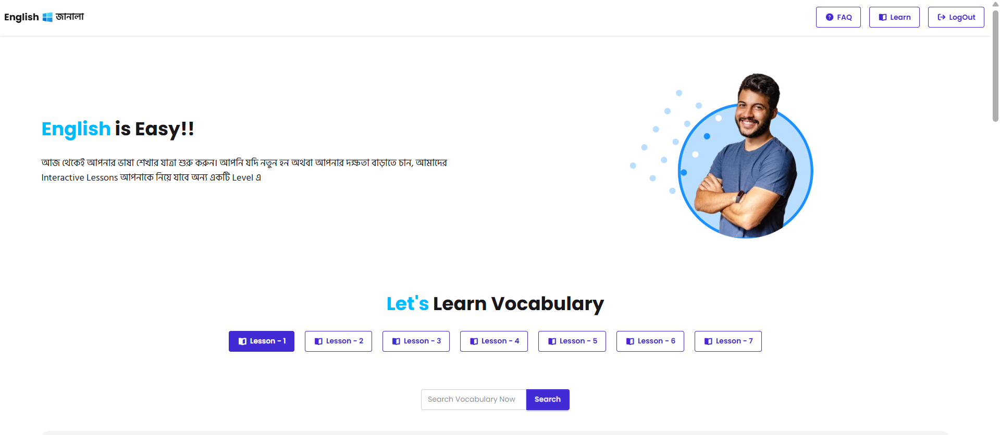
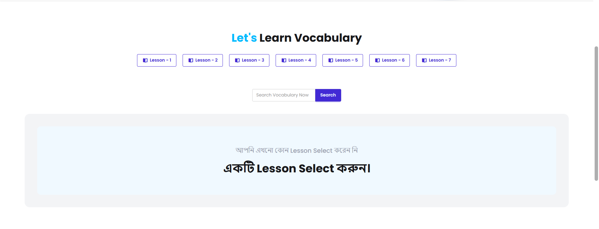
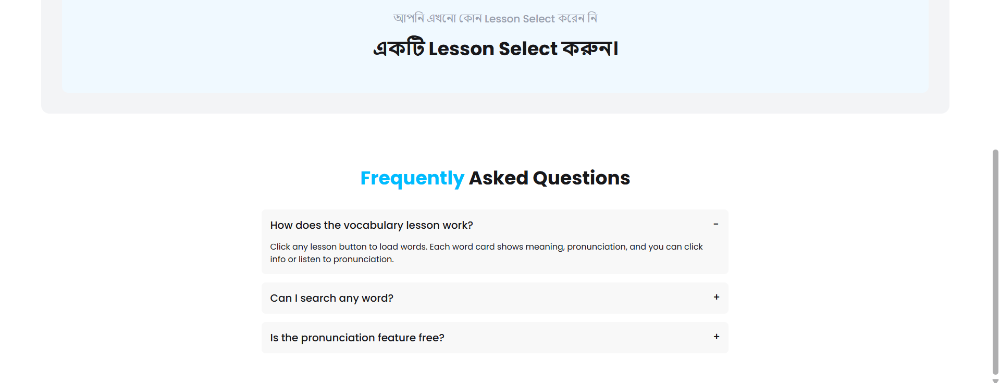
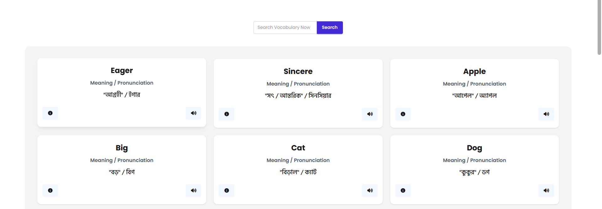
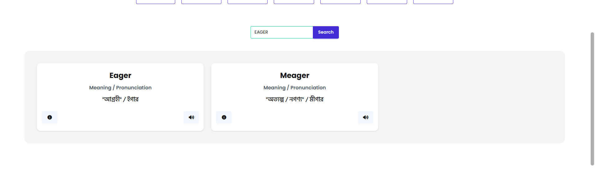

#  English Janala - Interactive English Learning Platform

A modern, interactive web application for learning English vocabulary through structured lessons with pronunciation support and real-time search functionality.

---

# 📸 Project Screenshots

### 🏠 Home Page


### 📖 Lesson Section


### 🧠 Word Cards


### 📘 Word Details Modal


### 🔎 Search Feature


---

# ✨ Features

## 🎯 Core Features
- Structured lesson system for vocabulary learning
- Interactive word cards with meaning and pronunciation
- Audio pronunciation using browser speech synthesis
- Real-time search across vocabulary
- Detailed word information with modal view

## 🎨 User Experience
- Smooth scroll animations
- Fully responsive design
- Loading indicators while fetching data
- Active lesson highlighting
- FAQ section with collapsible questions

## 🛠 Technical Features
- REST API integration
- Dynamic content rendering with JavaScript
- Modular file structure
- Tailwind CSS + DaisyUI UI components
- Web Speech API for pronunciation

---

# 📁 Project Structure

```

english-janala
│
├── index.html
├── style.css
├── script.js
│
├── UI
│   ├── 1.png
│   ├── 2.png
│   ├── 3.png
│   ├── 4.png
│   └── 5.png
│
├── assets
│   ├── logo.png
│   ├── hero-student.png
│   └── alert-error.png
│
└── README.md

````

---

# 🛠 Technologies Used

- HTML5
- CSS3
- JavaScript (ES6+)
- Tailwind CSS
- DaisyUI
- Font Awesome
- Google Fonts
- Programming Hero API

---

# 🎯 Usage

1. Select a lesson to load vocabulary words

2. Each word card shows

   * Word
   * Bengali meaning
   * Pronunciation

3. Click

   * 📘 for detailed information
   * 🔊 for pronunciation

4. Use the search bar to find words

5. Check FAQ for common questions

---

# 🔗 API Reference

```
https://openapi.programming-hero.com/api/levels/all

https://openapi.programming-hero.com/api/level/{level_no}

https://openapi.programming-hero.com/api/word/{word_id}

https://openapi.programming-hero.com/api/words/all
```

---


